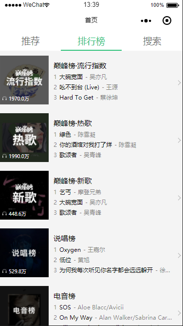
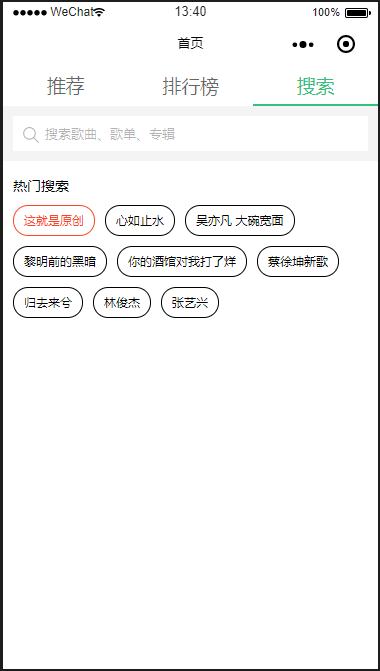

# taro-mbox
a music app by taro  
实现了一个音乐类小程序（QQ音乐简单版）
### 项目效果图
| 推荐页 | 排行榜 | 搜索页 |
| :------: | :------: | :------: |
|  |  |  
### 列表页  
  

| 微信小程序 | H5 | 
| :------: | :------: | 
| clone代码到开发者工具运行 |   |

### 本地运行
```bash
# 使用 yarn 安装依赖
$ yarn
# OR 使用 cnpm 安装依赖
$ cnpm install
# OR 使用 npm 安装依赖
$ npm install

# 运行微信小程序
$ npm run dev:weapp
# 运行 H5
$ npm run dev:h5
```

### License
MIT